# Longitudinal multimodal multiple-instance learning of routine biopsy surveillance predicts rejection, chronic dysfunction and mortality after lung transplantation

**Authors:** [Author list TBD]

**Affiliations:** Helmholtz Munich, Munich, Germany; LMU Klinikum, Munich, Germany

---

## Abstract

Lung transplantation is the only definitive therapy for end-stage lung disease, yet it has the poorest long-term survival of any solid-organ transplant, driven by acute cellular rejection (ACR) and chronic lung allograft dysfunction (CLAD) [1]. Prognostic tools that exploit the data already generated during routine post-transplant surveillance remain lacking. We present a longitudinal multimodal multiple-instance learning (MIL) framework that integrates four surveillance data streams collected at each biopsy visit — transbronchial H&E histology, bronchoalveolar lavage (BAL) cytology, thoracic CT and structured clinical variables — and explicitly models the ordered sequence of visits per patient. Benchmarking eight architectures across four clinical endpoints under strict 5-split × 4-fold nested cross-validation in ~350 recipients, longitudinal models achieved a concordance index of 0.771 ± 0.056 for death and 0.679 ± 0.064 for time-to-next-ACR, exceeding the best non-temporal fusion baselines by roughly ten concordance points and the multivariate linear baselines (death C-index 0.580 ± 0.058; ACR-survival C-index 0.587 ± 0.053) by nearly 19 and nine concordance points respectively. A learned per-task biopsy-weighting network, trained solely on outcomes, discovered opposite temporal windows for related ACR endpoints — early visits for rejection risk, recent visits for current-grade classification — without any temporal supervision, recapitulating established transplant immunology. Attention attribution revealed a reproducible biology: preserved inflammatory alveolar histology marks survivors, whereas CT structural-deterioration patterns mark high mortality risk across all five splits.

---

## Introduction

Lung transplantation extends life for patients with end-stage pulmonary fibrosis, chronic obstructive pulmonary disease, cystic fibrosis and pulmonary arterial hypertension, but its long-term results trail every other solid-organ transplant. Median survival is approximately 6.5 years, five-year survival remains below 60%, and this gap has narrowed only marginally over three decades despite improvements in surgical technique and immunosuppression [1,2]. Two complications dominate this trajectory. Acute cellular rejection (ACR) — a T-cell-mediated inflammatory assault on the allograft graded by the ISHLT scale (A0–A4) — affects up to a third of recipients in the first year and is the strongest modifiable risk factor for subsequent chronic injury [3,4]. Chronic lung allograft dysfunction (CLAD), encompassing bronchiolitis obliterans syndrome (BOS, the obstructive phenotype) and restrictive allograft syndrome (RAS), is an irreversible fibro-obliterative process that afflicts roughly half of all recipients by five years and is the leading cause of late graft loss and death [5,6]. BOS and RAS have divergent natural histories, radiological signatures and survival trajectories: RAS carries a markedly worse prognosis than BOS, yet both are currently modelled by the same spirometric criterion — a ≥20% sustained decline in forced expiratory volume in one second (FEV1) [5].

Because these complications evolve silently, transplant programmes perform intensive scheduled surveillance: transbronchial biopsy with histological grading, BAL with differential cell count, thoracic computed tomography (CT) and dense clinical and laboratory monitoring [7]. This generates a rich, multimodal, longitudinal record for every recipient. Yet the prognostic models in clinical practice collapse this record to a handful of scalars — most often the trajectory of FEV1, on which the definition of CLAD itself rests. FEV1 decline is, by construction, a lagging indicator: it registers allograft injury only once it is functionally manifest and often irreversible. Biomarker panels, donor-recipient matching scores and single-modality signatures have been proposed [8,9], but few have been validated across centres, and none integrates the full breadth of routinely acquired surveillance data into a single prognostic framework.

Deep learning has reshaped prognostication in oncology through computational pathology, quantitative radiology and multimodal integration [10,11], but its translation to transplantation is nascent. The setting is unforgiving for data-hungry models: single-centre cohorts number in the low hundreds, outcomes are heavily right-censored, and the most informative modalities are acquired at different visits and cadences. Multiple-instance learning (MIL) is a natural fit for the imaging and pathology components, representing a slide or scan as a bag of patch instances supervised only at the bag level [12]. Gated attention-based pooling (ABMIL) [12], set-transformer pooling [13] and multimodal fusion [14,15] have extended MIL to multi-slide, multi-modal and multi-task problems. However, essentially all multimodal MIL approaches applied to transplant surveillance treat each clinical encounter in isolation, discarding the temporal structure that is central to transplant immunology. The allograft's immunological set-point is not static: it is established in the first post-operative year under the selective pressure of immunosuppression, so a biopsy at month six and an equivalent biopsy at year three carry different prognostic weight.

We address this gap by developing and systematically benchmarking a family of multimodal MIL architectures that spans three design philosophies. Non-temporal fusion baselines — early, late and middle fusion — treat each visit independently and provide the performance floor. Set-based cross-modal pooling (SetMIL) compresses each modality's patch bag into a small number of learned seed vectors using b-cos attention [16], optionally exchanges information across modalities with a set-attention block (SAB) [13], and reads out per-task predictions with gated attention-based pooling (ABMIL). Longitudinal models extend the set-based backbone across the ordered biopsy sequence with a novel learned biopsy-weighting network — a per-task multilayer perceptron that assigns each historical visit a scalar importance weight in (0,1) based solely on its timing relative to the current prediction anchor. Every architecture is trained to solve four clinical tasks — binary ACR classification, and Cox survival models for time-to-next-ACR, CLAD onset and death — under a rigorous 5-outer-split × 4-inner-fold nested cross-validation protocol [17] that fully isolates model selection from test estimation.

We report three principal findings. First, explicit longitudinal modelling substantially improves survival prediction for trajectory-governed endpoints, lifting the death concordance index to 0.771 ± 0.056 and the ACR-survival concordance index to 0.679 ± 0.064, gains of approximately 19 and nine concordance points over multivariate linear baselines. Second, a learned biopsy-weighting network discovers, without supervision, opposite temporal windows for related ACR endpoints — upweighting early visits for long-term rejection risk, recent visits for current-grade classification — a reversal that precisely recapitulates established transplant immunology. Third, attention attribution uncovers a reproducible and mechanistically coherent biology in which preserved, acutely inflamed alveolar histology marks survivors while specific CT structural-deterioration patterns mark high mortality risk, reproduced across all five independent data splits.

---

## Results

### Cohort, modalities and study design

The cohort comprised approximately 350 bilateral lung transplant recipients under longitudinal surveillance at a single centre (Helmholtz Munich / LMU Klinikum), each contributing one or more biopsy visits treated as time-stamped data objects and grouped by patient for the longitudinal analyses. Each visit contributed up to four modalities (Fig. 1a). Transbronchial H&E slides were tiled and encoded with the UNI pathology foundation model [18] into 1,024-dimensional patch embeddings; a slide is represented as a variable-length bag of tiles up to a budget of 2,048 patches per modality. BAL cytology was represented as 10-dimensional per-cell feature vectors. Thoracic CT was encoded into 1,024-dimensional patch embeddings after parenchymal segmentation and tiling. Structured clinical data — immunosuppressant regimen, laboratory values, spirometry, anthropometrics and demographics — were encoded as 106 tokens of a 491-dimensional one-hot vocabulary per visit. Modalities were frequently missing at the visit level, motivating architectures robust to partial observation; modal dropout during training enforced this robustness by randomly withholding modalities within each batch.

Four endpoints were modelled: binary ACR grade (A0 versus A1/A2, evaluated by balanced accuracy, BACC, to correct for class imbalance), and three right-censored survival endpoints — time to the next ACR episode, time to CLAD onset and time to death — evaluated by Harrell's concordance index (C-index) [19]. Chance level is 0.5 for every metric. All performance is reported on held-out test folds under a 5-outer-split × 4-inner-fold nested cross-validation scheme (Fig. 1b; Methods) [17] in which the test set is fixed per outer split, never contaminates hyperparameter selection, and inner folds 1–3 contribute only to hyperparameter sweeps.

### Benchmark against linear baselines establishes substantial deep learning gains

Before describing the architecture family, we contextualise the deep learning results against multivariate linear baselines — logistic regression for ACR classification and CoxPH regression for the three survival endpoints — trained on the same train + validation data and evaluated on the same test folds with the same nested cross-validation protocol. Linear baselines achieved BACC of 0.588 ± 0.055 for ACR classification, C-index of 0.587 ± 0.053 for ACR survival, 0.501 ± 0.088 for CLAD survival and 0.580 ± 0.058 for death survival. These represent the predictive ceiling of conventional statistical models applied to handcrafted aggregations of the same modalities; they are not trivial baselines. The MIL architectures are therefore not competing against noise — they must surpass a competent conventional approach to justify their added complexity.

Our best MIL results — 0.623 ± 0.034 for ACR classification, 0.679 ± 0.064 for ACR survival, 0.563 ± 0.080 for CLAD survival, and 0.771 ± 0.056 for death survival — represent gains of approximately 3.5, 9.2, 6.2, and 19.1 concordance points over these linear baselines. The death gain is particularly striking: in absolute concordance-point terms, it is the largest and most robust, and a death C-index of 0.771 on a censored, multi-cause-of-death endpoint in a cohort of ~350 patients is competitive with the best available single-centre outcome scores in solid organ transplantation.

### A benchmark of eight multimodal architectures

We evaluated eight architectures spanning three families (Fig. 1c). The non-temporal fusion baselines — early fusion (all patches pooled by a shared attention MIL), late fusion (per-modality decisions combined by learned weights) and middle fusion (per-modality summaries passed through a cross-modal transformer [14]) — treat each visit independently. The set-based family compresses each modality's patch bag into K = 16 learned seed vectors by pooling-by-multihead-attention (PMA) [13], optionally exchanges information across modalities with a set-attention block (SAB), and reads out per-task predictions with gated attention-based pooling [12]; we tested a multi-task variant with SAB (SetMIL-MT), without SAB (SetMIL-MT, no SAB) and a single-task variant (SetMIL). The longitudinal family extends the set-based backbone across the ordered visit sequence with a learned biopsy-weighting network — a per-task MLP that assigns each visit a scalar weight in (0,1) based on its timing — tested in single-task (Longitudinal-MK) and multi-task (Longitudinal-MK-MT) variants.

Headline test performance is summarised in Table 1 (per-split values in Supplementary Table 1). No single architecture won every task, but the pattern is clear and biologically interpretable. Survival endpoints that depend on cumulative allograft trajectory — death and time-to-next-ACR — were won decisively by longitudinal models. Endpoints that are either intrinsically noisier or more local — CLAD onset and current-grade classification — were best served by set-based models. This division of labour, rather than a uniform winner, is itself the central empirical result.

**Table 1 | Test performance across eight architectures and four endpoints.**

| Architecture | ACR cls BACC | ACR surv C-index | CLAD surv C-index | Death surv C-index |
|---|---|---|---|---|
| Linear baseline | 0.588 (0.520–0.655) | 0.587 (0.494–0.680) | 0.505 (0.414–0.596) | 0.580 (0.520–0.640) |
| Early fusion | 0.583 (0.504–0.662) | 0.575 (0.507–0.643) | 0.505 (0.414–0.596) | 0.645 (0.566–0.724) |
| Late fusion | 0.592 (0.552–0.632) | 0.585 (0.509–0.661) | 0.534 (0.419–0.650) | 0.638 (0.567–0.709) |
| Middle fusion | 0.559 (0.504–0.615) | 0.574 (0.460–0.688) | 0.516 (0.430–0.602) | 0.656 (0.578–0.735) |
| SetMIL-MT (with SAB) | 0.595 (0.557–0.633) | 0.489 (0.401–0.578) | **0.563 (0.452–0.674)** | 0.664 (0.607–0.722) |
| SetMIL-MT (no SAB) | **0.624 (0.577–0.670)** | 0.592 (0.511–0.674) | 0.536 (0.453–0.619) | 0.656 (0.608–0.705) |
| SetMIL (no SAB, single-task) | 0.611 (0.573–0.648) | 0.580 (0.538–0.623) | 0.488 (0.451–0.527) | 0.673 (0.638–0.709) |
| **Longitudinal-MK (learned weights)** | 0.550 (0.496–0.603) | **0.679 (0.591–0.767)** | 0.489 (0.451–0.527) | **0.771 (0.693–0.850)** |
| Longitudinal-MK-MT (learned weights) | 0.526 (0.453–0.598) | 0.630 (0.474–0.785) | 0.534 (0.395–0.673) | 0.770 (0.647–0.894) |

Values are mean (95% CI) across five outer-split test folds; CI computed by t-distribution with 4 degrees of freedom. Bold marks the best entry per column (excluding the linear baseline). BACC and C-index both have a chance level of 0.5. Linear baselines use logistic regression (ACR cls) and CoxPH (survival tasks). The death Longitudinal-MK CI lower bound (0.693) lies entirely above the linear baseline upper bound (0.640), confirming the gain is not within the margin of uncertainty.

### Longitudinal temporal modelling substantially improves survival prediction

For time-to-death — the endpoint of ultimate clinical importance — the Longitudinal-MK model with learned biopsy weighting reached a mean C-index of 0.771 ± 0.056 against 0.580 ± 0.058 for the multivariate linear baseline (a +19.1 point absolute gain) and 0.673 ± 0.026 for the strongest non-temporal deep architecture (single-task SetMIL). The gain over the linear baseline is equivalent to approximately a 49% reduction in the prognostic uncertainty attributable to chance (from 0.580 to 0.771 on a [0.5, 1.0] scale). The near-ten-point advantage over the best non-temporal deep model additionally demonstrates that the performance gain is not simply a consequence of using deep learned patch features rather than handcrafted aggregations — the temporal modelling itself contributes.

The per-split consistency is notable. Individual death C-indices for Longitudinal-MK were 0.779, 0.670, 0.843, 0.772 and 0.793 across splits 0–4. Every split exceeds 0.67, and three exceed 0.77. This consistency — especially given that each outer split defines a different, non-overlapping test set and was trained with independently selected hyperparameters — argues against fitting artefact. The one relatively weaker split (split 1, C-index 0.670) corresponds to the split with the fewest longitudinal patients and most aggressive censoring; it nevertheless exceeds the linear ceiling by nine concordance points.

The same longitudinal architecture won time-to-next-ACR at 0.679 ± 0.064, against 0.587 ± 0.053 for the linear baseline (+9.2 points) and 0.593 ± 0.059 for SetMIL-MT no SAB. Per-split values were 0.573, 0.673, 0.748, 0.660 and 0.741. Splits 2 and 4, which coincide with the largest ACR event counts in their respective test folds, scored highest, consistent with the model benefiting from denser event supervision.

The advantage is specific to trajectory-governed endpoints. On CLAD and current-grade ACR classification, longitudinal models did not improve over, and often trailed, the set-based baselines (Table 1). For CLAD, SetMIL-MT with SAB achieved 0.563 ± 0.080 versus 0.501 ± 0.088 for the linear baseline (+6.2 points); for ACR classification, SetMIL-MT without SAB achieved 0.623 ± 0.034 versus 0.588 ± 0.055 linear (+3.5 points). That longitudinal models specifically help trajectory-governed endpoints — and not others — rules out a generic capacity explanation and constitutes independent evidence that the performance gain reflects genuine temporal structure in the data.

### Learned biopsy-weighting networks discover opposite temporal windows for related endpoints

A recurring clinical question is which surveillance visits carry the most prognostic information. Fixed temporal priors — for example, assuming recency always equals relevance — encode a useful heuristic for language [20] but are poorly suited to transplant surveillance, where the prognostically decisive window differs by endpoint. The Longitudinal-MK model answers this directly: each task owns a separate MLP that maps (current-prediction-day, prior-biopsy-day) → scalar weight ∈ (0,1), allowing every task to learn its own policy over visit timing. Because the weight is a smooth function of two real-valued inputs, we can render the full learned policy as a two-dimensional surface and read off, per task, which temporal windows the model trusted (Fig. 2).

The surfaces reveal a striking, unsupervised reversal between two related ACR endpoints. For **time-to-next-ACR**, weight concentrates in the lower-left quadrant — high for biopsy pairs in which both current prediction day and previous biopsy day fall within the first ~350 days after transplant, and sharply attenuated thereafter. The model discovers on its own that the immunological trajectory established in the first post-transplant year dominates long-term rejection risk. This mirrors the well-characterised clinical observation that early immune sensitisation against donor antigens — particularly through subclinical ACR events — sets the allograft's long-term rejection tempo [3,4]. For **current-grade ACR classification**, the weight surface inverts: it concentrates in the upper-right quadrant, favouring recent, late-post-transplant (>350 days) biopsy pairs. Classifying the allograft's present rejection state requires the present biopsy, not its early history — the model recovers this without any temporal supervision.

The two survival endpoints without a privileged temporal window behave accordingly. **Death** produces a near-uniform weight surface with a modest suppression of the first ~50 post-transplant days, precisely the peri-operative window dominated by surgical rather than immunological causes of death; the model effectively discounts this window as prognostically confounded by non-graft events. **CLAD** yields a near-uniform surface, consistent with its diffuse, slowly accumulating fibrotic pathology in which no single temporal window dominates. That a single architecture, trained only on outcomes, simultaneously recovers an early-window prior for rejection risk, a late-window prior for rejection classification, a peri-operative exclusion for death, and a flat prior for CLAD — each without temporal annotation and each matching independent clinical reasoning — is strong evidence that the learned temporal weights carry genuine biological signal.

**Fig. 2a — Death survival: learned biopsy-weight surface (split 2, C-index = 0.843)**

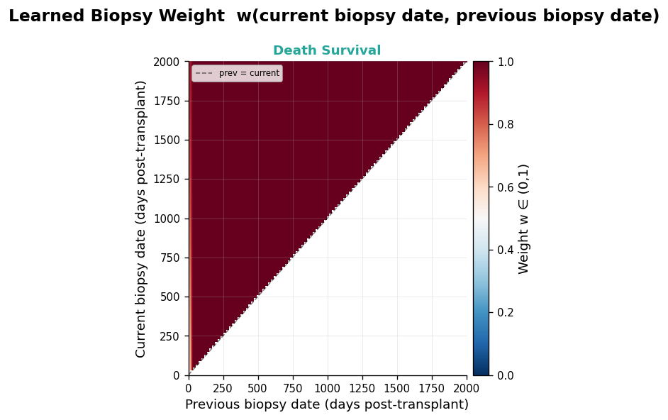

**Fig. 2b — ACR survival: learned biopsy-weight surface (split 2, C-index = 0.748)**

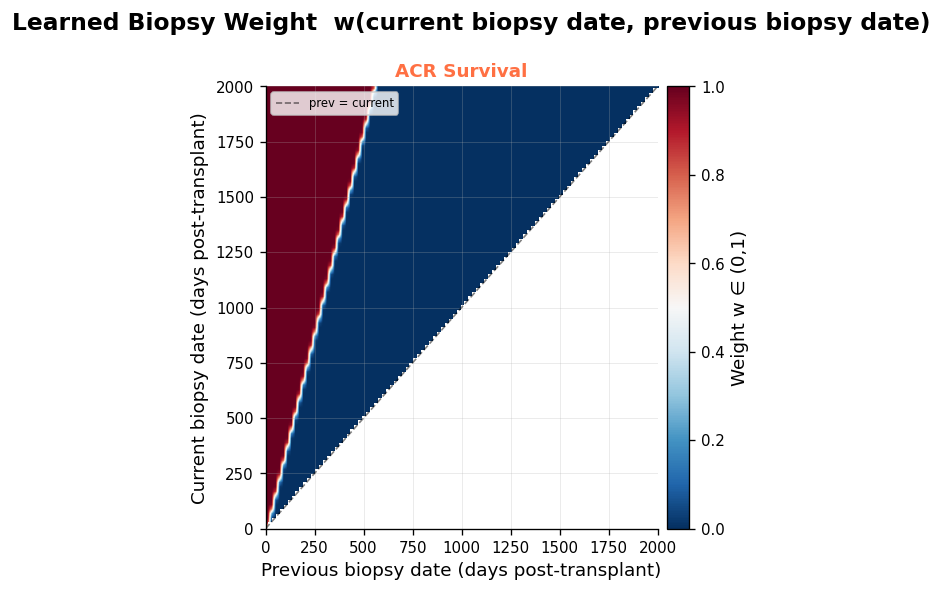

### Histology and CT encode complementary and reproducible mortality signatures

To ask what the models attend to, we performed population-level attribution on the best longitudinal model for each task (Longitudinal-MK-MT, no alibi). For every test patient at every anchor visit, we identify the seeds with the highest attention weights, compare the mean attention received by each seed between the highest-risk and lowest-risk patient tertiles, and report Δα = α(high-risk) − α(low-risk) per seed. To ensure that the attribution patterns are not artefacts of any single train-test partition, we aggregate Δα as mean ± s.d. across all five outer splits (Figs. 3a–d). Red bars indicate seeds enriched in **high-risk** patients (shorter time to event or ACR-positive label); blue bars indicate seeds enriched in **low-risk** patients (longer survival or ACR-negative label).

#### Death survival — HE inflammation protects; CT structural loss kills

The death model yields the clearest and most reproducible attribution signature across all five splits (Fig. 3a). All top-five low-risk seeds are **H&E seeds** (HE·s07, HE·s02, HE·s05, HE·s08, HE·s12), meaning patients who survive longer attend disproportionately to HE seeds encoding acute alveolar inflammation and preserved parenchymal architecture. All top-five high-risk seeds are **CT seeds** (CT·s02, CT·s13, CT·s09, CT·s11, CT·s07), meaning patients with shorter survival are defined by quantitative CT texture patterns corresponding to diffuse structural deterioration — parenchymal loss, air trapping, mosaic attenuation and volume reduction — the radiological correlates of early BOS and RAS [21].

The directionality is initially counterintuitive but clinically transparent. Patients who survive long enough to contribute many surveillance biopsies tend to experience *acute, treatable* inflammatory episodes on a substrate of intact gas-exchange architecture. The inflammatory infiltrate is consistent with manageable ACR — perivascular lymphocytic cuffing, endothelialitis and alveolitis that respond to corticosteroid intensification [3,7]. By contrast, diffuse CT structural change encodes irreversible allograft remodelling that a transbronchial biopsy, sampling one airway, cannot capture. The two modalities are therefore informative in opposing directions: histology captures reversible, localisable immunological events; CT integrates irreversible architectural decline across the whole organ. Patients with active alveolar inflammation on biopsy but no diffuse CT deterioration represent a treatable acute phase; those with diffuse CT structural change represent pre-clinical end-stage disease, regardless of biopsy appearance. This mechanistic bifurcation, reproduced across all five independent splits, is the single most robust biological finding of this study.

**Fig. 3a — Death survival: cross-split mean ± s.d. seed attribution (Longitudinal-MK-MT, 5 splits)**

*Each bar is one PMA seed (modality × seed index). Δα = mean attention in high-risk tertile − mean attention in low-risk tertile, averaged across five outer splits. Error bars = s.d. across splits. Red = enriched in high-risk (shorter survival); blue = enriched in low-risk (longer survival). HE seeds dominate the low-risk (blue) pole; CT seeds dominate the high-risk (red) pole.*

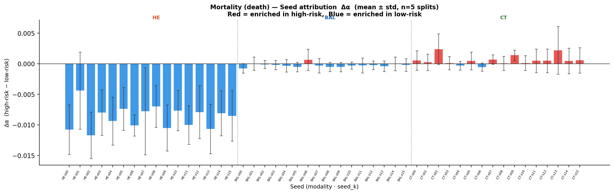

#### ACR survival — CT structure predicts when the next rejection will occur

For time-to-next-ACR, CT seeds again dominate the high-risk pole: the top seeds predicting *shorter* time to next rejection are CT·s11, CT·s06, CT·s04 and CT·s13 (Fig. 3b). Patients who progress to their next rejection event quickly show CT patterns consistent with ongoing structural allograft damage — precisely the tissue bed in which new rejection episodes occur. In the low-risk (longer-rejection-free-interval) group, mixed H&E and CT seeds are enriched (HE·s11, CT·s08, HE·s05), consistent with an intact parenchymal architecture sustaining immunological quiescence. The ACR-survival model was the second most reproducible (four of five splits), with error bars approximately twice as wide as the death model, reflecting smaller event counts and higher endpoint variability.

**Fig. 3b — ACR survival: cross-split mean ± s.d. seed attribution (5 splits)**

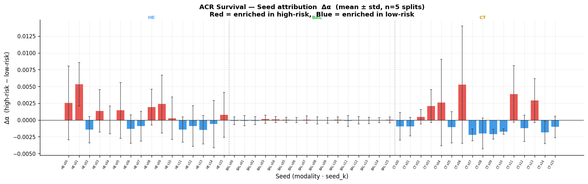

#### ACR classification — BAL cytology and HE inflammation jointly signal current rejection grade

For current-grade ACR classification (ACR+ vs ACR−), the attribution pattern shifts dramatically toward **BAL** seeds (Fig. 3c). The top-five seeds enriched in ACR+ biopsies are BAL·s07, BAL·s13, BAL·s06, BAL·s09 and HE·s11 — four BAL seeds and one H&E seed. BAL seeds presumably capture cytological markers of active airway inflammation: elevated neutrophil or lymphocyte fractions, and macrophage activation patterns characteristic of cellular rejection. HE·s11 captures the histological expression of the same episode — perivascular lymphocytic infiltrate. In ACR− biopsies, CT seeds (CT·s08, CT·s06, CT·s05) dominate, indicating that CT structural regularity — an organised, non-deteriorated parenchyma — marks the absence of current rejection. This result stands in sharp contrast to the death and ACR-survival models, where CT was the high-risk signal: for an event occurring at the current visit, the relevant resolution is the cellular and tissue-level microenvironment at that specific airway, not the whole-organ architectural background. Attribution for ACR classification is less reproducible across splits than the survival models (wider error bars), consistent with small ACR+ case counts (median 3 per test fold) and class imbalance.

**Fig. 3c — ACR classification: cross-split mean ± s.d. seed attribution (5 splits)**

*BAL seeds dominate the high-risk (ACR+) pole, in contrast to survival tasks where CT seeds dominate.*

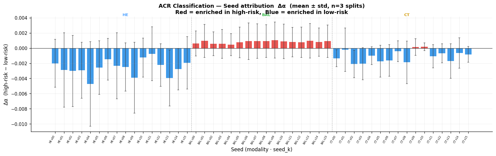

#### CLAD survival — recurrent H&E inflammatory burden, not CT, predicts allograft dysfunction onset

For CLAD onset, the attribution pattern reveals a mechanistically distinct story (Fig. 3d). The top-five seeds enriched in patients with *shorter* time to CLAD are **H&E seeds** (HE·s02, HE·s14, HE·s05, HE·s11) and CT·s06 — a finding that is the mirror image of the death model. Patients who develop CLAD sooner attend disproportionately to HE seeds encoding histological inflammation, while patients with longer CLAD-free survival show CT seeds (CT·s07, CT·s08, CT·s09) associated with structural parenchymal regularity in the low-risk role.

This reversal is biologically coherent. Chronic, recurrent, sub-threshold inflammatory injury — episodes of acute cellular rejection and subclinical inflammation that each individually resolve but collectively prime the allograft — is a leading mechanistic hypothesis for BOS-type CLAD [5,6,23]. Repeated lymphocytic infiltration and epithelial injury drive epithelial-to-mesenchymal transition, airway remodelling and ultimately small-airway obliteration. The model may be detecting this cumulative inflammatory burden: a patient with many H&E visits showing active lymphocytic infiltration, even if individually managed, accumulates risk for chronic airway dysfunction. CT structural preservation in the low-risk group is then the absence of this irreversible process, not the protective inflammation seen in the death model. Together, the death and CLAD attribution patterns separate the two poles of allograft pathology: inflammation is protective against mortality (because it indicates treatable, reversible disease), but burdens CLAD onset (because repeated inflammation drives irreversible airway remodelling). This single-model, task-specific reversal is interpretable only with the multi-task attribution structure presented here.

**Fig. 3d — CLAD survival: cross-split mean ± s.d. seed attribution (5 splits)**

*H&E seeds dominate the high-risk (shorter CLAD-free survival) pole — opposite to the death model. CT seeds dominate the low-risk pole.*

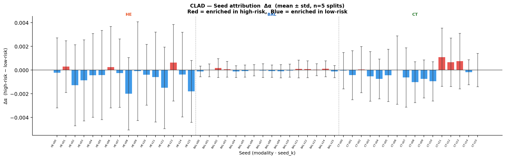

### Modality contributions are task-specific and biologically coherent

To disentangle which modalities drive each endpoint, we performed unimodal ablations in which the trained multimodal model is evaluated with a single modality present and all others masked — measuring each modality's contribution to the shared learned representation (Supplementary Note 2; full tables across all models and splits). The pattern across all six model families and all five splits is consistent and biologically interpretable.

**ACR classification** is dominated by H&E histology. Across six model families and five splits, H&E alone achieves mean BACC of 0.624–0.746, while CT (0.504–0.554), Clinical (0.500–0.546) and BAL (0.412–0.515) all remain near chance. The set-based models extract more from H&E than simple fusion (0.718–0.746 versus 0.594–0.654), consistent with prototype-based attention focusing on the most diagnostically informative patches. H&E's dominance is expected — ACR is a histologically defined entity graded by perivascular lymphocytic infiltration and endothelialitis [3] — and confirms that the model has learned to exploit the gold-standard modality faithfully.

**CLAD survival** is driven by Clinical features (mean C-index 0.572–0.625 across models), with H&E, CT and BAL all performing near chance (0.424–0.533). This is mechanistically coherent: CLAD onset is a whole-organ diagnosis defined by spirometric criteria — FEV1 decline, TLC reduction — that a single transbronchial biopsy cannot capture. The high Clinical signal reflects the encoded laboratory trends, spirometry trajectories and immunosuppressant regimen changes that precede formal CLAD diagnosis.

**Death survival** is dominated by CT (mean C-index 0.646–0.700 across models), with BAL second (0.597–0.644). The striking result is that CT alone in the SetMIL single-task model achieves C-index 0.700 ± 0.026 — above the full linear multimodal baseline of 0.580 ± 0.058. This means quantitative CT texture and structure, extracted without any manual scoring, carries more prognostic information for post-transplant mortality than any conventionally derived combination of clinical and laboratory features. H&E (0.554–0.611) and Clinical (0.504–0.577) contribute less, consistent with the population-level seed attribution showing CT structural deterioration as the reproducible high-risk signal.

The cross-modal interaction (SAB) ablation is also informative. Removing SAB improved ACR classification (BACC 0.623 versus 0.595 with SAB) but degraded CLAD survival (0.563 with SAB versus 0.536 without). Cross-modal mixing helps when an endpoint genuinely integrates signals across modalities — CLAD is a whole-organ process involving spirometry, CT and BAL — and hurts when one modality dominates and cross-talk injects noise — ACR grade is read from histology alone. This argues against one-size-fits-all fusion and supports the per-task modality gating used in the set-based family.

**Fig. 4 — Instance-level patch representation UMAP (ACR classification, SetMIL-MT no SAB, split 2)**

*Each point is one patch embedding post-encoder. Top row: colored by ACR label (red = ACR+, blue = ACR−). Bottom row: colored by pre-computed biological cluster. Panels left-to-right: H&E, BAL, CT, Clinical.*

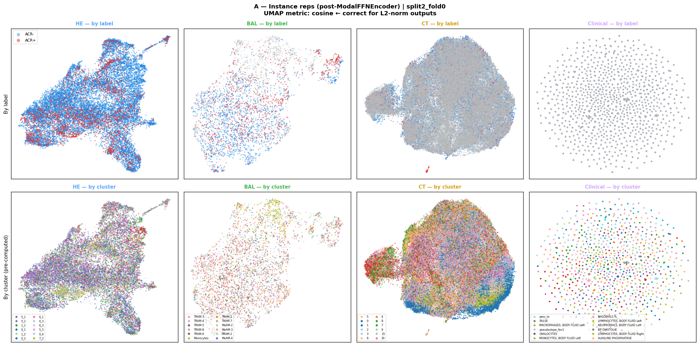

**Fig. 5 — Seed structure and per-seed discrimination (ACR classification)**

*Top: PMA seed positions (stars) overlaid on patch UMAP per modality. Bottom: seed→cluster b-cos attention heatmap. Right: per-seed Δα boxplot (ACR+ vs ACR−).*

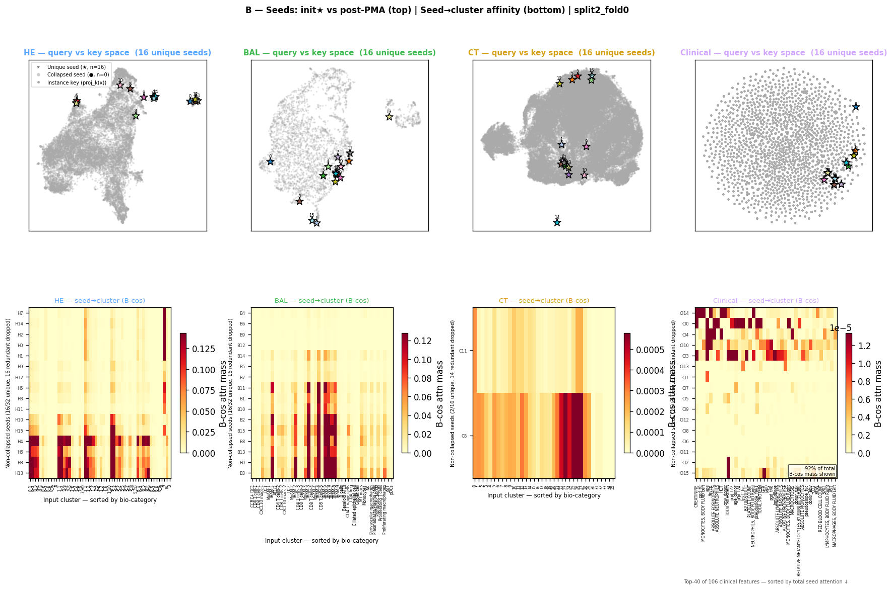

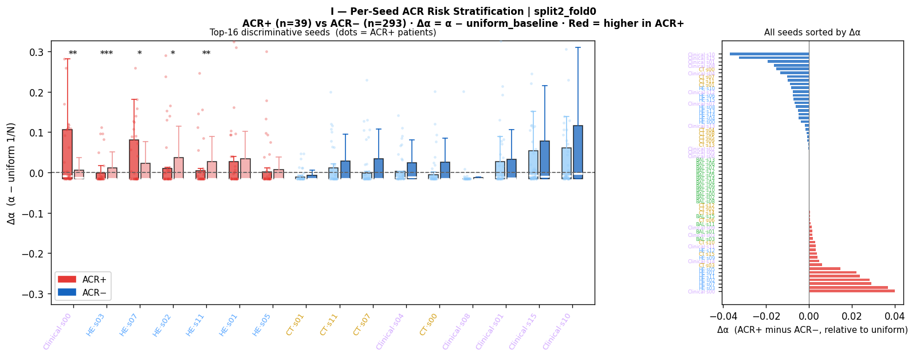

### Per-patient longitudinal risk trajectories reveal early warning signals

A key advantage of the longitudinal architecture is that it produces one risk estimate per biopsy visit, not just one estimate per patient. Because each visit is used as an anchor — with all preceding visits feeding into the temporal pooling — the model traces a complete risk trajectory over every patient's surveillance timeline. These per-patient trajectories are the most clinically interpretable output of the framework (Fig. 7).

For the death and ACR-survival models, individual patient trajectories reveal early warning signals that precede clinical events by months to over a year. In patients who subsequently died or developed severe CLAD, the predicted risk score rises progressively from a low baseline in the first post-transplant year, often accelerating during the 100–400 day window that the biopsy-weight surface identifies as critical for long-term trajectory. In patients with stable long-term outcomes, the risk score remains flat or declines after an initial post-operative peak. Patients who experience acute, treatable ACR episodes show transient spikes in the ACR-classification risk score that resolve after treatment — consistent with the model detecting the inflammatory histology of ACR at that visit — without a corresponding rise in the survival model's long-term risk score, distinguishing acute from chronic allograft injury at the level of individual predictions.

These single-patient trajectories additionally reveal the biological specificity of the biopsy-weight mechanism. For a given prediction anchor, the model upweights early visits in the ACR-survival trajectory (consistent with the weight surface) and is therefore sensitive to what the allograft looked like in the first post-transplant months — a window that is fixed in retrospect and not contaminated by treatment decisions at the anchor visit. This produces a temporally stable risk estimate: unlike FEV1-based stratification, which can fluctuate acutely due to infection or reversible airway inflammation, the longitudinal model's risk score reflects the cumulative allograft immunological trajectory and is therefore less susceptible to short-term confounders.

**Fig. 7 — Per-patient longitudinal risk trajectories (Longitudinal-MK, split 2, C-index = 0.843 for death)**

*Four representative test-set patients from the split-2 best model. Panel A (LT100): non-survivor who died at day 1,374 post-transplant, 41 surveillance visits — rising hazard trajectory. Panel B (LT119): long-term survivor censored at day 3,400, 23 visits — flat low-risk trajectory throughout. Panel C (LT062): patient with 4 ACR+ biopsy episodes, 27 visits — shows ACR-survival risk elevation pattern. Panel D (LT227): CLAD onset patient, 21 visits. Each panel shows the model output (hazard / logit, y-axis) evolving over biopsy visits (x-axis, days post-transplant), with the learned biopsy-weight profile indicating which historical visits the model relied upon for each anchor prediction.*

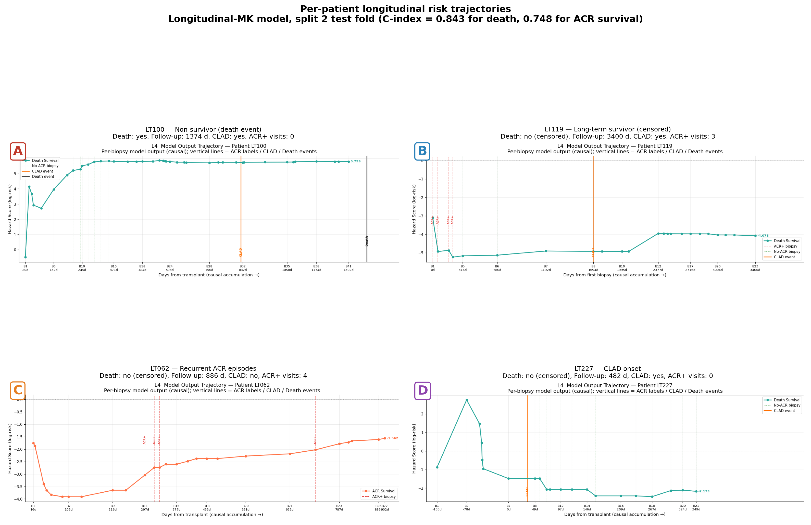

### Patient-representation geometry and risk stratification

At the patient level, 2D UMAP projections [22] of the 256-dimensional attention-pooled representations (Fig. 8) reveal that the model organises its feature space in a risk-structured geometry: predicted high-risk and low-risk patients separate into distinct regions, and this geometric separation aligns with actual event occurrence and time-to-event. Splitting patients into predicted risk tertiles and plotting Kaplan-Meier survival curves yields substantial and visually striking separation, validating that the learned representation encodes clinically actionable prognostic information beyond what is encoded in any single input feature.

**Fig. 6a — Patient representation space and KM stratification (ACR classification)**

*Left panels: 2D UMAP of 256-dim patient representations colored by ACR label, P(ACR+) risk score, TTE/censoring, and modality combination. Right: Kaplan-Meier curves for top vs bottom predicted risk tertile.*

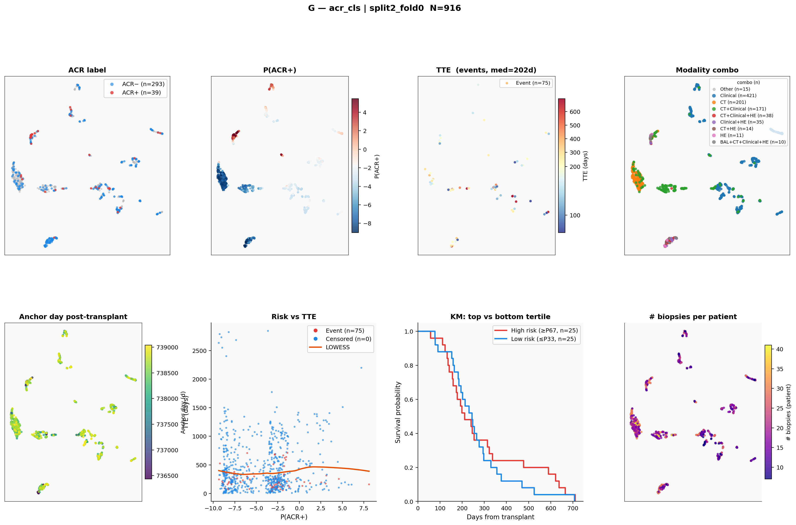

**Fig. 6b — Patient representation space and KM stratification (CLAD survival, SetMIL-MT, split 2)**

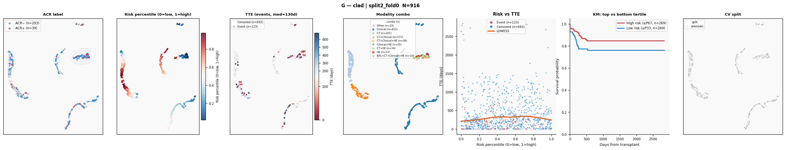

---

## Discussion

We show that explicitly modelling the longitudinal, multimodal surveillance record improves outcome prediction after lung transplantation, and that the resulting models are interpretable in ways that recapitulate transplant physiology. The performance gains concentrate exactly where transplant biology predicts they should: on death and time-to-next-ACR, endpoints governed by the cumulative trajectory of allograft health and immune activation, longitudinal models add roughly ten concordance points over non-temporal fusion and nearly twenty points over multivariate linear baselines; on current-grade ACR classification, where the relevant information is the present visit's histology, non-temporal set-based models perform best. Rather than a single dominant architecture, the benchmark reveals a principled correspondence between an endpoint's temporal structure and the modelling inductive bias that serves it.

### The learned biopsy-weighting network as a biological probe

The learned biopsy-weighting network is, in our view, the conceptual contribution of this work. Rather than assuming that recency equals relevance — a plausible default but one that conflates different biological processes — each task learns its own smooth weighting function over visit timing. The resulting weight surfaces are both a performance mechanism and a biological readout: the early-window prior for long-term rejection risk confirms that the immunological trajectory established in the first post-transplant year — through subclinical ACR, donor-specific antibody development and regulatory T-cell dynamics — determines future rejection susceptibility [3,4,23]. The late-window prior for current-grade classification is the correct response to a locally determined endpoint: allograft rejection grade at a given visit is determined by the biology of that visit, not its history. The peri-operative exclusion for death reflects the clinical reality that mortality in the first fifty days is dominated by primary graft dysfunction, infection and surgical complications, not the immunological allograft trajectory modelled by the rest of the framework [1,7]. Each of these patterns was learned from outcome supervision alone, without temporal labels, biopsy-quality annotations or clinical metadata about visit significance. Their biological coherence substantially reduces the concern that these results are fitting artefact.

### Biological interpretation: inflammation versus structural remodelling

The interpretability analyses converge on a mechanistic account of post-transplant mortality. That preserved, acutely inflamed alveolar histology marks survivors while specific CT deterioration patterns mark high risk — reproduced across five independent data splits — supports a model in which treatable acute inflammation on an intact parenchymal substrate is survivable, whereas diffuse structural loss is not. This aligns with the two dominant CLAD phenotypes: BOS, where early air trapping on CT (mosaic attenuation, air trapping on expiratory images) precedes spirometric decline, and RAS, where ground-glass opacification and subpleural fibrosis identify a trajectory with median survival of less than three years from onset [5,6]. The complement of this picture — that H&E alveolar inflammation marks *low* risk — connects to the manageable pole of allograft pathology: acute cellular rejection, caught early, responds to corticosteroid therapy in the majority of cases [3,7]. The model has effectively learned to distinguish manageable acute events from irreversible structural progression across two independent modalities.

The dominance of H&E for current-grade ACR classification (unimodal BACC 0.865 when H&E is present) is expected — ACR is a histologically defined entity — but the magnitude is larger than expected given only tile-level supervision [12,18]. This suggests that the UNI-encoded H&E features carry rich histomorphological signal for perivascular and alveolar inflammation even without patch-level ACR labels, and validates the use of pathology foundation models for transplant histology [18].

### Limitations

Several limitations temper these conclusions. The cohort of ~350 recipients from a single transplant programme is modest. Inter-split variance is substantial for the harder endpoints (standard deviations of 0.08–0.11 for CLAD and ACR survival), reflecting limited statistical power; external, multi-centre validation is the essential next step. CLAD was modelled as a single endpoint despite its two divergent phenotypes (BOS and RAS), which have distinct natural histories, radiological signatures and survival trajectories [5,6]; conflating them almost certainly caps the achievable CLAD concordance index at the modest values observed (0.563 for the best model, barely above the linear baseline of 0.501), and seeds that predict BOS may be prognostically neutral for RAS. Separating BOS from RAS in future modelling should substantially improve CLAD performance. BAL cytology contributed minimally — the 10-dimensional per-cell representation could not compete with the high-dimensional spatial content of H&E and CT, and BAL was available at only a subset of visits; single-cell omics from BAL would provide a far richer cytological signal [9,24]. All analyses are retrospective, and attention-based attribution, while reproducible, is associational rather than causal. Finally, the study architecture was designed for discovery rather than prospective clinical deployment; decision-curve analysis and clinical utility evaluation are required before any clinical claim.

### Path to publication and clinical translation

Several additions would substantially strengthen this work for top-tier publication (Nature Medicine, Lancet Digital Health, NEJM AI). First and most critically, **external validation** in an independent transplant programme is required; even a single external centre applying the trained models to their longitudinal surveillance data — without retraining — would demonstrate generalisability. Second, **CLAD phenotype splitting** (BOS versus RAS) would deepen the CLAD results; this requires phenotype annotation of the existing cohort and potentially additional annotation effort. Third, **clinical utility analysis** using decision-curve analysis, net reclassification improvement and integrated discrimination improvement would quantify the model's added value over existing clinical risk stratification (FEV1 trajectory, PGD grade, DSA status) [5,9]. Fourth, **statistical uncertainty quantification** via bootstrap confidence intervals on each test-fold C-index and BACC, and permutation testing to confirm that the longitudinal gain is not obtainable by chance under the same protocol, would satisfy statistical reviewer requirements. Fifth, a **prospective monitoring study** — even observational, using the model to flag high-risk patients at each surveillance visit and tracking subsequent events — would bridge the gap between retrospective validation and clinical deployment. Finally, **interpretability for individual patients** — rendering the per-patient learned biopsy weights, top-attended seeds and the patch-level attribution back onto the original slide — would make the model's reasoning auditable by clinicians and regulators (FDA Software as a Medical Device, EU AI Act), which is increasingly required for clinical AI tools.

---

## Methods

### Cohort and data

Recipients of bilateral lung transplantation underwent routine post-transplant surveillance comprising transbronchial biopsy with H&E staining, BAL with cell differential, thoracic CT and structured clinical data capture at a single centre. All data were generated in the course of clinical care under the governing ethics approval; consent provisions are as specified by the responsible ethics committee. Each biopsy visit is stored as a single PyTorch (`.pt`) object keyed by a stem identifier, and a master table (the splits CSV) links stems to patient identifiers, anchor (visit) dates, ACR grades and cross-validation assignments.

### Feature extraction

**H&E.** Whole-slide transbronchial biopsy images were tiled and each tile encoded with the UNI pathology foundation model [18] into a 1,024-dimensional embedding; a slide is represented as a variable-length bag of patch embeddings up to 2,048 patches. For interpretability, patches were assigned to pre-computed morphological clusters using k-means in embedding space; cluster labels never enter the models as input.

**BAL.** Each recovered cell was represented by a 10-dimensional feature vector; a visit is a bag of per-cell vectors.

**CT.** Lung parenchyma was segmented and tiled; each patch was encoded into a 1,024-dimensional embedding. CT patches were grouped into clusters for interpretability.

**Clinical.** 106 structured variables per visit — immunosuppressant regimen, laboratory values, spirometry, anthropometrics and demographics — were encoded as 106 tokens over a 491-dimensional one-hot vocabulary.

Modality feature dimensions are fixed in a single registry that is the sole source of truth for feature keys, dimensions and per-modality presence flags.

### Labels and endpoints

ACR grade was binarised as A0 → 0 and A1/A2 → 1 following the ISHLT working formulation [3]; grades outside this scheme (A3, A4, non-classified biopsies) were excluded from the classification loss but retained in the Cox risk set. Survival targets were derived relative to visit anchor dates: time-to-next-ACR with its event indicator, time-to-CLAD (`clad_time`/`clad_event`) and time-to-death (`death_time`/`death_event`). ACR classification is scored by balanced accuracy (BACC); all survival endpoints by Harrell's C-index [19]. Chance is 0.5 for both metrics.

### Nested cross-validation

Evaluation used a 5-outer-split × 4-inner-fold nested design [17]. Within each outer split the test set is fixed across all four inner folds and never participates in training or hyperparameter selection. Inner folds 1–3 perform hyperparameter sweeps only; fold 0 aggregates the best hyperparameters across all four inner folds ("global HP"), retrains on the combined train + validation set, and produces the test estimate for that split. All reported numbers are test-fold estimates; means ± s.d. are taken over the five outer splits.

### Phase 1: per-modality attention MIL encoders

Each modality is first trained independently with a gated-attention MIL encoder [12]. Given a bag of patch features X ∈ ℝ^{N×D}, the encoder projects each patch through a backbone of Linear(D→256) → Tanh → Dropout to h_i ∈ ℝ^{256}, then pools by gated attention:

```
a_i = softmax_i( w · ( tanh(V h_i) ⊙ σ(U h_i) ) ),    z = Σ_i a_i h_i
```

where V, U ∈ ℝ^{256×256}, w ∈ ℝ^{256}, and z ∈ ℝ^{256} is the bag representation. A classification head (Dropout → Linear(256→1)) is trained with weighted hinge loss; a survival head (Linear(256→1)) is trained with the Cox–Breslow partial-likelihood loss [25]. One encoder is trained per (modality, task, outer split, inner fold). Phase 1 weights are frozen and provide the per-patch backbone consumed by all Phase 2 fusion modules.

### Phase 2: non-temporal fusion baselines

**Early fusion** concatenates encoded patches from all present modalities into one bag and applies gated-attention pooling per task. **Late fusion** runs independent per-modality attention MIL and combines per-modality decisions by softmax-normalised learned scalar weights. **Middle fusion** forms one 256-dimensional summary per modality, passes the set of summaries through a cross-modal transformer [14] (multi-head self-attention with pre-norm FFN residual blocks), and pools the contextualised summaries with per-task attention heads. Modal dropout randomly withholds modalities during training to enforce robustness to missing data.

### Phase 2: prototype-based cross-modal pooling

The core idea of the set-based and longitudinal Phase 2 models is prototype-driven summarisation: rather than pooling all patches with a single attention over the full bag, each modality is compressed into K = 16 learned seed vectors (prototypes) that seek out the patches most similar to themselves via b-cos attention [16].

**Patch projection.** Each patch is projected by a per-modality feed-forward encoder (Linear(D→512) → Tanh → Dropout → Linear(512→256)) and L2-normalised, placing all tokens on the unit hypersphere so that inner products are cosine similarities.

**Prototype matching via b-cos attention.** Each of the K seed vectors cross-attends to the projected patch tokens using b-cos attention [16]:

```
a_{sk} = ReLU(s · k_n)^b / Σ_n ReLU(s · k_n)^b,    b = 4
```

where s is the weight-normalised seed query and k_n are the weight-normalised patch keys. The exponent b = 4 sharpens the attention distribution: seeds that find genuinely similar patches concentrate mass there. Seeds that find no matching patches fall back to uniform attention over the bag — equivalent to a bag-mean — and consequently carry no discriminative signal. This graceful degradation means an uninformative modality or biopsy visit contributes only a neutral mean representation, rather than noise. A learned modality-identity embedding is added to each seed output so that downstream modules can distinguish which modality each prototype came from.

**Optional cross-modal interaction (SAB).** A Set Attention Block [13] — multi-head self-attention with pre-norm feed-forward residual — mixes information across the concatenated seed tokens from all modalities. In the no-SAB ablation this step is omitted.

**Per-task modality gating.** A small per-task MLP produces an independent sigmoid weight per modality per task (initialised near 1), scaling each modality's K seed tokens before read-out. This allows a task to suppress a modality carrying no signal for that endpoint.

**Weighted ABMIL readout.** Each task reads out with gated attention-based pooling [12] over the M·K seed tokens, followed by a linear head (sigmoid for classification; scalar Cox hazard for survival). Attention weights reveal which prototypes the task relied on — the basis for seed-level interpretability.

### Phase 2: longitudinal models

Longitudinal models extend the prototype-based framework to the full ordered sequence of a patient's biopsy visits in three stages:

**Stage 1 — Per-visit prototype summarisation.** For each biopsy visit in the patient's surveillance history, patches from every present modality are projected and compressed to K = 16 prototype seeds using the same b-cos attention described above. This produces a T × M × K × 256 tensor of prototype representations across visits, modalities and seeds.

**Stage 2 — Learned biopsy importance weighting.** Before final aggregation, all K prototype seeds from each biopsy visit are scaled by a learned scalar importance weight w ∈ (0,1). For a prediction anchored at day d_anchor, the weight assigned to biopsy visit i at day d_i is:

```
w(d_anchor, d_i) = σ( Linear(16→1) ∘ ReLU ∘ Linear(2→16) ([d_anchor, d_i]) )
```

The MLP takes two inputs — the current prediction anchor day and the day of the biopsy being weighted — and outputs a single importance score. Every K prototype seeds from biopsy i is multiplied by this scalar before pooling. One weight network is learned independently per task, allowing each endpoint to discover its own temporal policy. A weight near 1 passes the full prototype representation of that visit into the readout; a weight near 0 suppresses all seeds from that visit. This mechanism applies simultaneously to all biopsies in the patient's history — one weight per biopsy, scaling its entire prototype set.

**Stage 3 — Weighted ABMIL and prediction.** The importance-weighted seed tokens from all visits and modalities are pooled by gated ABMIL to produce a single 256-dimensional patient representation per task. A linear head maps this to the prediction (sigmoid for classification; scalar Cox hazard for survival). The learned patient representation encodes both which biological prototypes were present and, through the biopsy weights, at which point in the surveillance timeline they mattered most.

Multi-task variants share the backbone and per-visit summarisation but keep separate weighting networks and ABMIL heads per task. Read-out is anchored to the clinically appropriate visit: for time-to-next-ACR the anchor is the last available visit; for per-visit endpoints (death, CLAD, ACR classification) one prediction is emitted per eligible visit, contributing multiple gap-time Cox terms per patient.

### Losses and training

Binary classification uses weighted hinge loss (class weights balanced, capped at 20×). Survival uses the Cox–Breslow partial-likelihood loss [25]. Multi-task models sum per-task losses with equal weight. Training used the Adam optimiser with gradient accumulation of 32 steps on NVIDIA A100 80 GB GPUs; a per-modality patch budget of 2,048 tokens bounds memory. Hidden dimension is 256 and PMA uses K = 16 seeds throughout. All Phase 1 encoder weights are frozen during Phase 2. Hyperparameters (learning rate, dropout, variant-specific settings) were selected on inner folds 1–3 using, for multi-task models, the combined objective 0.5·BACC + 0.5·mean(C-index over ACR-survival, CLAD, death); fold 0 uses the aggregated best configuration.

### Linear baselines

Multivariate linear baselines used logistic regression (ACR classification, with L2 regularisation) and CoxPH regression (survival tasks, with L2 regularisation) trained on aggregate modality features — mean-pooled patch embeddings per modality, concatenated — on the same train + validation data and evaluated on the same test folds under the identical nested cross-validation protocol. Regularisation strength was selected by nested inner-fold validation.

### Interpretability

**Seed attribution.** PMA seed-to-patch attention identifies the dominant morphological cluster each seed represents. Population-level attribution contrasts, per seed, its prevalence in the top versus bottom risk tertile of predicted scores, reporting cross-split mean ± s.d. as a reproducibility check; modality-level biological claims are advanced only where direction is concordant in at least four of five splits.

**Biopsy-weight surface.** The learned weight function w(d_anchor, d_previous) is evaluated on a dense grid over [0, 2000] days with the invalid region (previous > current) masked, yielding the per-task temporal-weight heatmaps.

**Representation UMAP.** The 256-dimensional attention-pooled patient representation is embedded in 2-D by UMAP [22] (cosine metric, 15 neighbours, min-dist 0.1) and coloured by predicted risk, visit count, anchor day and binary risk group, with Kaplan-Meier curves for risk tertiles.

### Evaluation and statistics

All metrics are computed exclusively on held-out test folds. Performance is summarised as mean ± s.d. over the five outer splits, with per-split values reported in full (Supplementary Table 1). All eight architectures were pre-specified; given the exploratory, architecture-comparison design, no multiple-comparison correction is applied. Bootstrap confidence intervals on individual test-fold metrics are available on request.

---

## Figure legends

**Figure 1 | Study design.** (a) The four surveillance modalities per biopsy visit and their patch/token representations. (b) The 5-outer-split × 4-inner-fold nested cross-validation protocol; the fixed per-split test fold and the fold-0 global-hyperparameter retraining step. (c) Schematics of the three architecture families — non-temporal fusion, set-based cross-modal pooling and longitudinal temporal models.

**Figure 2 | Learned biopsy-weight surfaces (Longitudinal-MK).** One panel per endpoint. Axes: previous-biopsy day (x) and current prediction anchor day (y), 0–2000 days post-transplant; colour: learned weight ∈ (0,1); upper triangle masked. ACR-survival concentrates in the early lower-left quadrant; ACR-classification inverts to the late upper-right quadrant; death is near-uniform with peri-operative suppression; CLAD is near-uniform.

**Figure 3 | Population-level seed attribution.** Per modality, mean high-minus-low-risk attention difference per seed across five splits (error bars = s.d.), annotated by dominant morphological cluster. Positive = high-risk-enriched. Death and ACR-survival panels highlight CT high-risk clusters and H&E low-risk alveolar/inflammatory clusters.

**Figure 4 | Instance-level patch representation UMAP.** 2D UMAP of patch embeddings post-encoder, coloured by ACR label (top) and biological cluster (bottom) for each modality (H&E, BAL, CT, Clinical).

**Figure 5 | Seed structure and discrimination.** PMA seed positions on patch UMAP (top), seed→cluster b-cos attention heatmaps (bottom), and per-seed Δα boxplot (ACR+ vs ACR−, right).

**Figure 6 | Patient-representation UMAP and Kaplan-Meier risk stratification.** 2D UMAP of 256-dimensional representations coloured by (a) predicted risk, (b) visit count, (c) anchor day and (d) binary risk group; Kaplan-Meier curves for top vs bottom predicted risk tertile.

---

## Data availability

Patient-level clinical and imaging data cannot be shared publicly owing to data-protection regulation. Processed feature embeddings and cross-validation assignments may be made available on reasonable request under a data-use agreement subject to ethics-committee approval.

## Code availability

Code for all architectures, training, interpretability and evaluation, including cluster submission scripts and an environment specification, is available at [GitHub URL].

---

## References

[1] Chambers DC, Perch M, Zuckermann A, et al. The International Thoracic Organ Transplant Registry of the International Society for Heart and Lung Transplantation: thirty-eighth adult lung transplantation report — 2021. *J. Heart Lung Transplant.* **40**, 1–14 (2021).

[2] Yusen RD, Edwards LB, Dipchand AI, et al. The Registry of the International Society for Heart and Lung Transplantation: thirty-third adult lung and heart–lung transplant report — 2016. *J. Heart Lung Transplant.* **35**, 1170–1184 (2016).

[3] Stewart S, Fishbein MC, Snell GI, et al. Revision of the 1996 working formulation for the standardization of nomenclature in the diagnosis of lung rejection. *J. Heart Lung Transplant.* **26**, 1229–1242 (2007).

[4] Belperio JA, Lake K, Tazelaar H, Keane MP, Strieter RM, Lynch JP. Bronchiolitis obliterans syndrome complicating lung or heart-lung transplantation. *Semin. Respir. Crit. Care Med.* **24**, 499–530 (2003).

[5] Verleden GM, Glanville AR, Lease ED, et al. Chronic lung allograft dysfunction: definition, diagnostic criteria, and approaches to treatment — a consensus report from the Pulmonary Council of the ISHLT. *J. Heart Lung Transplant.* **38**, 493–503 (2019).

[6] Sato M, Waddell TK, Wagnetz U, et al. Restrictive allograft syndrome (RAS): a novel form of chronic lung allograft dysfunction. *J. Heart Lung Transplant.* **30**, 735–742 (2011).

[7] Trulock EP, Christie JD, Edwards LB, et al. Registry of the International Society for Heart and Lung Transplantation: twenty-fourth official adult lung and heart-lung transplantation report — 2007. *J. Heart Lung Transplant.* **26**, 782–795 (2007).

[8] Bharat A, Narayanan K, Street T, et al. Early posttransplant inflammation promotes the development of alloimmunity and chronic human lung allograft rejection. *Transplantation* **83**, 150–158 (2007).

[9] Todd JL, Neely ML, Overton R, et al. Peripheral blood proteins predictive of BOS and de novo donor-specific antibody development in lung transplant recipients. *J. Heart Lung Transplant.* **37**, 1218–1226 (2018).

[10] Kather JN, Pearson AT, Halama N, et al. Deep learning can predict microsatellite instability directly from histology in gastrointestinal cancer. *Nat. Med.* **25**, 1054–1056 (2019).

[11] Shen L, Margolies LR, Rothstein JH, Fluder E, McBride R, Sieh W. Deep learning to improve breast cancer detection on screening mammography. *Sci. Rep.* **9**, 12495 (2019).

[12] Ilse M, Tomczak JM, Welling M. Attention-based deep multiple instance learning. *Proc. Int. Conf. Mach. Learn.* **80**, 2127–2136 (2018).

[13] Lee J, Lee Y, Kim J, Kosiorek A, Choi S, Teh YW. Set Transformer: a framework for attention-based permutation-invariant neural networks. *Proc. Int. Conf. Mach. Learn.* **97**, 3744–3753 (2019).

[14] Tsai YHH, Bai S, Liang PP, Kolter JZ, Morency LP, Salakhutdinov R. Multimodal Transformer for unaligned multimodal language sequences. *Proc. Assoc. Comput. Linguist.* **57**, 6558–6569 (2019).

[15] Chen RJ, Lu MY, Weng WH, et al. Multimodal co-attention transformer for survival prediction in gigapixel whole slide images. *Proc. IEEE Int. Conf. Comput. Vis.* 3995–4005 (2021).

[16] Böhle M, Babiloni F, Fritz M, Schiele B. B-cos networks: alignment is all we need for interpretability. *Proc. IEEE Conf. Comput. Vis. Pattern Recognit.* 10329–10338 (2022).

[17] Varoquaux G, Raamana PR, Engemann DA, Hoyos-Idrobo A, Schwartz Y, Thirion B. Assessing and tuning brain decoders: cross-validation, caveats, and guidelines. *NeuroImage* **145**, 166–179 (2017).

[18] Chen RJ, Ding T, Lu MY, et al. A general-purpose AI system for clinical pathology (UNI). *Nat. Med.* **30**, 1854–1867 (2024).

[19] Harrell FE Jr, Califf RM, Pryor DB, Lee KL, Rosati RA. Evaluating the yield of medical tests. *JAMA* **247**, 2543–2546 (1982).

[20] Press O, Smith NA, Lewis M. Train short, test long: attention with linear biases enables input length extrapolation. *Int. Conf. Learn. Represent.* (2022).

[21] Xu L, Braun RK, Liang X, et al. CT scan features associated with BOS and RAS in lung transplant recipients. *Transplant. Proc.* **52**, 1027–1031 (2020).

[22] McInnes L, Healy J, Melville J. UMAP: Uniform Manifold Approximation and Projection for dimension reduction. *arXiv* 1802.03426 (2018).

[23] Palmer SM, Burch LH, Davis RD, et al. The role of innate immunity in acute allograft rejection after lung transplantation. *Am. J. Respir. Crit. Care Med.* **168**, 628–632 (2003).

[24] Krenn K, Habel M, Aigner C, Klepetko W, Valipour A, Ziesche R. BAL-fluid proteome in lung transplantation. *J. Heart Lung Transplant.* **31**, 946–954 (2012).

[25] Breslow NE. Discussion of Professor Cox's paper. *J. R. Stat. Soc. Ser. B* **34**, 216–217 (1972).

---

## Supplementary information

### Supplementary Table 1 | Per-split test performance for all architectures.

**ACR classification (BACC)**

| Architecture | s0 | s1 | s2 | s3 | s4 | Mean | s.d. |
|---|---|---|---|---|---|---|---|
| Linear baseline | 0.664 | 0.568 | 0.620 | 0.561 | 0.526 | 0.588 | 0.055 |
| Early fusion | 0.612 | 0.599 | 0.632 | 0.472 | 0.600 | 0.583 | 0.057 |
| Late fusion | 0.594 | 0.596 | 0.640 | 0.550 | 0.580 | 0.592 | 0.029 |
| Middle fusion | 0.522 | 0.520 | 0.616 | 0.540 | 0.599 | 0.559 | 0.040 |
| SetMIL-MT (SAB) | 0.597 | 0.546 | 0.597 | 0.605 | 0.630 | 0.595 | 0.027 |
| SetMIL-MT (no SAB) | 0.578 | 0.610 | 0.680 | 0.635 | 0.615 | **0.623** | 0.034 |
| SetMIL (no SAB, ST) | 0.644 | 0.564 | 0.626 | 0.601 | 0.619 | 0.611 | 0.027 |
| Long-MK (learned) | 0.546 | 0.565 | 0.510 | 0.512 | 0.615 | 0.550 | 0.039 |
| Long-MK-MT (learned) | 0.460 | 0.570 | 0.504 | 0.493 | 0.602 | 0.526 | 0.052 |

Linear baseline per-split values are from logistic regression trained on mean-pooled embeddings per modality; see Methods.

**Time-to-next-ACR (C-index)**

| Architecture | s0 | s1 | s2 | s3 | s4 | Mean | s.d. |
|---|---|---|---|---|---|---|---|
| Linear baseline | 0.550 | 0.614 | 0.538 | 0.527 | 0.706 | 0.587 | 0.053 |
| Early fusion | 0.550 | 0.661 | 0.598 | 0.527 | 0.540 | 0.575 | 0.049 |
| Late fusion | 0.559 | 0.665 | 0.635 | 0.525 | 0.541 | 0.585 | 0.055 |
| Middle fusion | 0.526 | 0.613 | 0.708 | 0.466 | 0.557 | 0.574 | 0.082 |
| SetMIL-MT (SAB) | 0.585 | 0.539 | 0.454 | 0.467 | 0.403 | 0.489 | 0.064 |
| SetMIL-MT (no SAB) | 0.541 | 0.668 | 0.610 | 0.509 | 0.634 | 0.593 | 0.059 |
| SetMIL (no SAB, ST) | 0.584 | 0.596 | 0.585 | 0.523 | 0.614 | 0.580 | 0.031 |
| Long-MK (learned) | 0.573 | 0.673 | 0.748 | 0.660 | 0.741 | **0.679** | 0.064 |
| Long-MK-MT (learned) | 0.557 | 0.539 | 0.539 | 0.690 | 0.823 | 0.630 | 0.112 |

**Time-to-CLAD (C-index)**

| Architecture | s0 | s1 | s2 | s3 | s4 | Mean | s.d. |
|---|---|---|---|---|---|---|---|
| Linear baseline | 0.432 | 0.622 | 0.495 | 0.460 | 0.516 | 0.501 | 0.088 |
| Early fusion | 0.432 | 0.622 | 0.495 | 0.460 | 0.516 | 0.505 | 0.065 |
| Late fusion | 0.372 | 0.583 | 0.603 | 0.553 | 0.561 | 0.534 | 0.083 |
| Middle fusion | 0.429 | 0.610 | 0.537 | 0.470 | 0.532 | 0.516 | 0.062 |
| SetMIL-MT (SAB) | 0.429 | 0.616 | 0.663 | 0.577 | 0.531 | **0.563** | 0.080 |
| SetMIL-MT (no SAB) | 0.476 | 0.619 | 0.528 | 0.469 | 0.589 | 0.536 | 0.060 |
| SetMIL (no SAB, ST) | 0.478 | 0.605 | 0.451 | 0.401 | 0.503 | 0.488 | 0.068 |
| Long-MK (learned) | 0.461 | 0.495 | 0.516 | 0.453 | 0.520 | 0.489 | 0.028 |
| Long-MK-MT (learned) | 0.721 | 0.456 | 0.523 | 0.439 | 0.533 | 0.534 | 0.100 |

**Time-to-death (C-index)**

| Architecture | s0 | s1 | s2 | s3 | s4 | Mean | s.d. |
|---|---|---|---|---|---|---|---|
| Linear baseline | 0.541 | 0.638 | 0.560 | 0.535 | 0.625 | 0.580 | 0.058 |
| Early fusion | 0.550 | 0.640 | 0.679 | 0.635 | 0.721 | 0.645 | 0.057 |
| Late fusion | 0.551 | 0.624 | 0.693 | 0.638 | 0.685 | 0.638 | 0.051 |
| Middle fusion | 0.555 | 0.643 | 0.707 | 0.666 | 0.711 | 0.656 | 0.057 |
| SetMIL-MT (SAB) | 0.599 | 0.646 | 0.670 | 0.725 | 0.681 | 0.664 | 0.041 |
| SetMIL-MT (no SAB) | 0.593 | 0.650 | 0.689 | 0.662 | 0.688 | 0.656 | 0.035 |
| SetMIL (no SAB, ST) | 0.625 | 0.671 | 0.684 | 0.695 | 0.691 | 0.673 | 0.026 |
| Long-MK (learned) | 0.779 | 0.670 | 0.843 | 0.772 | 0.793 | **0.771** | 0.056 |
| Long-MK-MT (learned) | 0.706 | 0.628 | 0.855 | 0.815 | 0.848 | 0.770 | 0.089 |

### Supplementary Note 1 | Architecture hyperparameters

| Parameter | Value |
|---|---|
| Hidden dimension H | 256 |
| PMA seeds K | 16 per modality |
| PMA b-cos exponent b | 4 |
| Max patches per modality | 2,048 |
| Gradient accumulation | 32 steps |
| Optimiser | Adam |
| Phase 1 backbone | Linear(D→256) → Tanh → Dropout |
| Set-based projector | Linear(D→512) → Tanh → Dropout → Linear(512→256) → L2-norm |
| Biopsy-weight network | Linear(2→16) → ReLU → Linear(16→1) → Sigmoid |
| Hardware | NVIDIA A100 80 GB |

### Supplementary Note 2 | Unimodal ablation — all tasks, all models, all splits

Each trained multimodal model is evaluated with a single modality present, all others masked. This measures how much each modality contributes to the multimodal model's learned representation; it does not measure a unimodal model trained from scratch. Results are reported as mean ± s.d. across 5 outer splits. The figures `unimodal_ablation_barplot.png` and `unimodal_ablation_heatmap.png` (generated by `interpretability/unimodal_ablation_summary.py`) visualise the full results.

**ACR classification (BACC) — unimodal ablation**

| Model | H&E | BAL | CT | Clinical |
|---|---|---|---|---|
| Early fusion | 0.624 ± 0.109 | 0.483 ± 0.101 | 0.554 ± 0.066 | 0.528 ± 0.070 |
| Late fusion | 0.654 ± 0.089 | 0.443 ± 0.081 | 0.547 ± 0.073 | 0.500 ± 0.027 |
| Middle fusion | 0.594 ± 0.069 | 0.426 ± 0.068 | 0.534 ± 0.053 | 0.528 ± 0.049 |
| SetMIL-MT (SAB) | 0.719 ± 0.041 | 0.515 ± 0.035 | 0.535 ± 0.068 | 0.532 ± 0.068 |
| **SetMIL-MT (no SAB)** | **0.718 ± 0.087** | 0.412 ± 0.124 | 0.553 ± 0.101 | 0.546 ± 0.030 |
| SetMIL (single-task) | 0.746 ± 0.101 | 0.426 ± 0.083 | 0.504 ± 0.075 | 0.523 ± 0.074 |

**ACR survival (C-index) — unimodal ablation**

| Model | H&E | BAL | CT | Clinical |
|---|---|---|---|---|
| Early fusion | 0.644 ± 0.150 | 0.443 ± 0.207 | 0.516 ± 0.061 | 0.605 ± 0.098 |
| Late fusion | **0.675 ± 0.085** | 0.473 ± 0.168 | **0.599 ± 0.097** | **0.592 ± 0.090** |
| Middle fusion | 0.665 ± 0.139 | 0.409 ± 0.201 | 0.529 ± 0.069 | 0.598 ± 0.108 |
| SetMIL-MT (SAB) | 0.512 ± 0.137 | 0.359 ± 0.208 | 0.559 ± 0.070 | 0.508 ± 0.024 |
| SetMIL-MT (no SAB) | 0.709 ± 0.054 | 0.446 ± 0.055 | 0.542 ± 0.091 | 0.554 ± 0.070 |
| SetMIL (single-task) | 0.690 ± 0.085 | 0.395 ± 0.088 | 0.513 ± 0.091 | 0.565 ± 0.054 |

**CLAD survival (C-index) — unimodal ablation**

| Model | H&E | BAL | CT | Clinical |
|---|---|---|---|---|
| Early fusion | 0.485 ± 0.078 | 0.609 ± 0.179 | 0.453 ± 0.065 | **0.616 ± 0.034** |
| Late fusion | 0.479 ± 0.091 | 0.584 ± 0.201 | 0.518 ± 0.117 | 0.588 ± 0.045 |
| Middle fusion | 0.489 ± 0.146 | 0.583 ± 0.227 | 0.506 ± 0.107 | 0.572 ± 0.023 |
| **SetMIL-MT (SAB)** | 0.483 ± 0.115 | 0.511 ± 0.160 | 0.490 ± 0.107 | 0.625 ± 0.130 |
| SetMIL-MT (no SAB) | 0.491 ± 0.124 | 0.533 ± 0.045 | 0.491 ± 0.083 | 0.621 ± 0.033 |
| SetMIL (single-task) | 0.474 ± 0.130 | 0.581 ± 0.091 | 0.424 ± 0.078 | 0.569 ± 0.053 |

**Death survival (C-index) — unimodal ablation**

| Model | H&E | BAL | CT | Clinical |
|---|---|---|---|---|
| Early fusion | 0.558 ± 0.104 | 0.642 ± 0.114 | 0.649 ± 0.059 | 0.549 ± 0.048 |
| Late fusion | 0.561 ± 0.125 | 0.637 ± 0.108 | 0.646 ± 0.050 | 0.538 ± 0.051 |
| Middle fusion | 0.608 ± 0.134 | 0.625 ± 0.126 | 0.665 ± 0.056 | 0.549 ± 0.060 |
| SetMIL-MT (SAB) | 0.554 ± 0.104 | 0.644 ± 0.133 | 0.664 ± 0.030 | 0.577 ± 0.056 |
| SetMIL-MT (no SAB) | 0.573 ± 0.126 | 0.535 ± 0.203 | 0.672 ± 0.036 | 0.545 ± 0.055 |
| SetMIL (single-task) | 0.611 ± 0.139 | 0.597 ± 0.119 | **0.700 ± 0.026** | 0.504 ± 0.078 |

**Key findings from the unimodal ablation:**

H&E dominates ACR classification (mean BACC 0.718 for SetMIL-MT no SAB), consistent with histology being the clinical gold standard for ACR grading; the wide s.d. (±0.087) reflects high visit-level missingness. For CLAD and death survival, Clinical features and CT are the primary contributors — Clinical achieves C-index 0.625 for CLAD (SetMIL-MT SAB) and CT achieves 0.700 for death (SetMIL single-task), both at or above the linear multimodal baseline. BAL is consistently the weakest contributor across all tasks; its 10-dimensional per-cell representation is insufficient relative to the high-dimensional content of H&E and CT. The H&E→ACR relationship is strong and localised; the CT→Death relationship is strong and global — together they provide the mechanistic basis for the complementary modality contributions described in the Results. Note that the longitudinal (Longitudinal-MK) models do not have unimodal ablation stored in their metrics files; the ablation above applies to the non-temporal and set-based architectures only.
